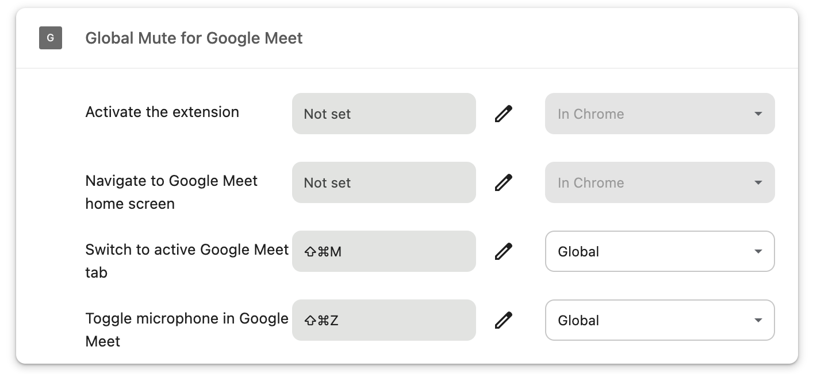

# 🔇 Global Mute for Google Meet

A lightweight Chrome extension to globally mute or unmute your microphone on Google Meet — even when you're outside of Chrome.

Built using Manifest V3 with clean code and customizable hotkeys.

---

## 🚀 Features

- 🎤 **Toggle Mic** on Google Meet with `Ctrl + Shift + Z`
- 🔄 **Switch to active Meet tab** with `Ctrl + Shift + M`
- 🏠 **Navigate to Meet home** (`https://meet.google.com`) with `Ctrl + Shift + G`
- 🌐 Works globally — even when Chrome is not in focus
- ⚙️ Hotkeys are configurable via `chrome://extensions/shortcuts`

---

## 💻 How to Use

1. Install the extension (download or clone this repo, then load it as unpacked — see below).
2. Join or open a Google Meet call.
3. Use the configured hotkeys to control the mic or navigate between Meet tabs.

---

## ⌨️ Set Global Keyboard Shortcuts

1. Open Chrome and visit:  
   [`chrome://extensions/shortcuts`](chrome://extensions/shortcuts)

2. Find **Global Mute for Google Meet**

3. Set the shortcuts:
   - **Toggle microphone in Google Meet** → `Ctrl + Shift + Z`
   - **Switch to active Google Meet tab** → `Ctrl + Shift + M`
   - **Navigate to Google Meet home screen** → `Ctrl + Shift + G`

4. Change the dropdown on the right from `In Chrome` to `Global`.

### ✅ Example

---

## 🧩 How to Load Unpacked Extension (for development)

1. Clone or download this repo.
2. Visit: `chrome://extensions/`
3. Enable **Developer mode**.
4. Click **Load unpacked** and select the folder containing `manifest.json`.
5. Done!

---

## 📁 Folder Structure
<pre>MuteForMeetMV3/
├── manifest.json
├── background.js
├── content.js
├── popup.html
├── popup.js
├── icon.png
├── icon48.png
├── icon128.png
└── screenshots/
└──── global-shortcut-setup.png</pre>

---

## 🛠 Tech Stack

- Manifest V3
- Chrome Extensions API
- JavaScript (no frameworks)
- Service Worker for hotkey handling
- Content scripts for mic control

---

## 📦 Publishing Notes

This extension is compatible with the latest Chrome requirements. Once tested, zip the folder contents and upload it to the [Chrome Web Store Developer Console](https://chrome.google.com/webstore/devconsole).

---

## 📄 License

Apache-2.0 license. Free to use and modify.

---

## 🙌 Credits

Built by zegulas — feel free to contribute or report issues!

